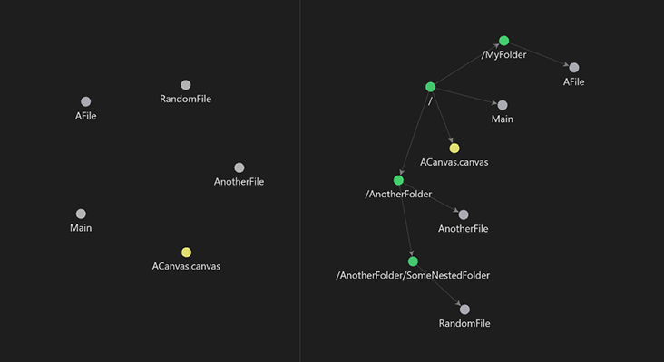

# Folders to Graph

> Combine your folder structure into your graphs

This following is an [Obsidian](https://obsidian.md) plugin which allows you to display your vault folder structure into
your graphs.

## How does it works?

By enabling this extension, all you graphs will add your vault folder structure into their view. Really usefull if you
use folders to structure your notes.

## How to use it?

Nothing more easier:

-   Go on Obsidian, then click on the `Settings` button on the left-bottom corner,
-   Go to `Community plugins` tab,
    -   If needed, enable them by clicking on `Turn on community plugins`,
-   Click on `Browse`, then search `Folders to Graph`,
-   Download the plugin, then enable it.

### Want to install it manually?

-   Go on the [repo releases tab](https://github.com/Ratibus11/folders2graph/releases),
-   Download the release you want,
-   Go to your vault plugins folder (eg. `/path/to/your/vault/.obsidian/plugin`),
-   Finally, extract the downloaded zip content here,

## Changelog

### 2024-11-14

-   Add settings tab
-   Toggle display of the root folder node (`/`) (from [#6](https://github.com/ratibus11/folders2graph/issues/6))
    (_displayed by default_)
-   Supports French and English. Feel free to suggest new translations!

### 2024-02-05

-   Plugin first release.
-   Allows to display your Obsidian vault folder structure into your graphs by enabling the extension.

> Inspired on drPilman's [`obsidian-graph-nested-tags`](https://github.com/drPilman/obsidian-graph-nested-tags) obsidian
> plugin. Check this out.
