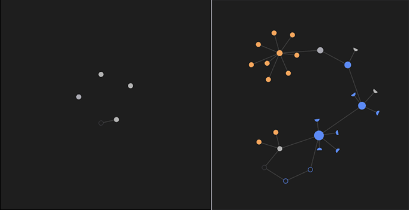

# Folders to Graph

> Combine your folder structure into your graphs

This following is an [Obsidian](https://obsidian.md) plugin which allows you to display your vault folder structure and
headings into your graphs.

## How does it works?

By enabling this extension, all you graphs will add your vault folder structure into their view. Really usefull if you
use folders to structure your notes.

You can also display your files' headings into the graph, and even fold/unfold them to hide/show their content.

## How to use it?

Nothing more easier:

- Go on Obsidian, then click on the `Settings` button on the left-bottom corner,
- Go to `Community plugins` tab,
    - If needed, enable them by clicking on `Turn on community plugins`,
- Click on `Browse`, then search `Folders to Graph`,
- Download the plugin, then enable it.

Noice functionnalities:

- Fold and unfold nodes by Shift+clicking them:
    - Shift+left-click folds a node's whole subtree, or reveals its direct children when fully folded.
    - Shift+right-click unfolds recursively.
- Show/hide the folder or heading nodes independently from the command palette (Mod+Shift+G and Mod+Shift+H by default).
- Define a list of folders to include or exclude from the graph, with an option to hide excluded files entirely instead
  of leaving them disconnected.
- Ctrl/Cmd+click a folder node to pre-fill the graph search with a `path:"…"` filter; Ctrl/Cmd+click the root node to
  clear it.
- Choose how [[note#Heading]] links are drawn: file → file, file → heading, heading → file, or heading → heading.
- Ghost nodes for unresolved wikilinks: missing folders, files, and headings implied by unresolved links appear as
  outlined nodes. Clicking a ghost creates the content (folder, file, or heading) and redirect you to it.

### Want to install it manually?

- Go on the [repo releases tab](https://github.com/Ratibus11/folders2graph/releases),
- Download the release you want,
- Go to your vault plugins folder (eg. `/path/to/your/vault/.obsidian/plugin`),
- Finally, extract the downloaded zip content here,

## Changelog

### 2026-06-13 - **1.2.0**

- New features
    - Heading nodes ([#24](https://github.com/ratibus11/folders2graph/issues/24)) — Display each note's heading
      structure in the graph. Notes referenced under a heading attach to that heading, and heading nodes have their own
      configurable color.
    - Fold & unfold ([#32](https://github.com/ratibus11/folders2graph/issues/32)) — Shift+left-click folds a node's
      whole subtree, or reveals its direct children when fully folded; Shift+right-click unfolds recursively. Folded
      nodes render as half-discs oriented toward their parent. Fold state persists across restarts, and an Unfold all
      graph nodes command resets everything.
    - Weight nodes by descendants ([#33](https://github.com/ratibus11/folders2graph/issues/33)) — Optional: node size
      reflects every displayed descendant at any depth, not just direct children. Folded nodes shrink accordingly.
    - Folder filtering ([#31](https://github.com/ratibus11/folders2graph/issues/31)) — Include or exclude a list of
      folders (recursive, one path per line), with an option to hide filtered-out files entirely instead of leaving them
      disconnected.
    - Folder search ([#27](https://github.com/ratibus11/folders2graph/issues/27)) — Ctrl/Cmd+click a folder node to
      pre-fill the graph search with a `path:"…"` filter; Ctrl/Cmd+click the root node to clear it.
    - Ghost nodes for unresolved wikilinks ([#53](https://github.com/ratibus11/folders2graph/issues/53)) — Missing
      folders, files, and headings implied by unresolved links now appear as outlined nodes, correctly chained in the
      hierarchy. Clicking a ghost creates the content (folder, file, or heading) and then behaves like a regular click:
      explorer highlight, or opening the note at the new section.
    - Heading link anchoring ([#53](https://github.com/ratibus11/folders2graph/issues/53)) — Choose how [[note#Heading]]
      links are drawn: file → file, file → heading, heading → file, or heading → heading (default). The mode only
      affects edges — ghost headings stay visible regardless.
    - Commands & hotkeys ([#25](https://github.com/ratibus11/folders2graph/issues/25),
      [#48](https://github.com/ratibus11/folders2graph/issues/48)) — Toggle folder nodes (Mod+Shift+G), heading nodes
      (Mod+Shift+H), the root folder node, and subtree weighting from the command palette.
    - Folder node color ([#23](https://github.com/ratibus11/folders2graph/issues/23)) — Folder nodes use a configurable
      color instead of the tag color.

- Improvements
    - Settings tab reorganized into native-style groups (Folders, Headings, Folder filtering, Weighting), with refreshed
      English and French copy.
    - The graph refreshes automatically on vault changes (file/folder create, delete, rename, and content edits),
      keeping ghost states accurate.

- Bug fixes
    - Bookmarked graph views no longer flash and revert to the global settings while the plugin is active
      ([#28](https://github.com/ratibus11/folders2graph/issues/28)).
    - The plugin now disables and re-enables cleanly — startup and shutdown were hardened
      ([#38](https://github.com/ratibus11/folders2graph/issues/38)).
    - Right-clicking no longer stacks multiple "New note/folder" modals
      ([#37](https://github.com/ratibus11/folders2graph/issues/37)).
    - Unresolved wikilinks with exotic paths (leading slash, empty segments) no longer generate malformed phantom folder
      nodes — the crash reported in [#35](https://github.com/ratibus11/folders2graph/pull/35) is structurally impossible
      now.

### 2024-11-14 - **1.1.0**

- Add settings tab
- Toggle display of the root folder node (`/`) (from [#6](https://github.com/ratibus11/folders2graph/issues/6))
  (_displayed by default_)
- Supports French and English. Feel free to suggest new translations!

### 2024-02-05 - **1.0.0**

- Plugin first release.
- Allows to display your Obsidian vault folder structure into your graphs by enabling the extension.

> Inspired on drPilman's [`obsidian-graph-nested-tags`](https://github.com/drPilman/obsidian-graph-nested-tags) obsidian
> plugin. Check this out.
